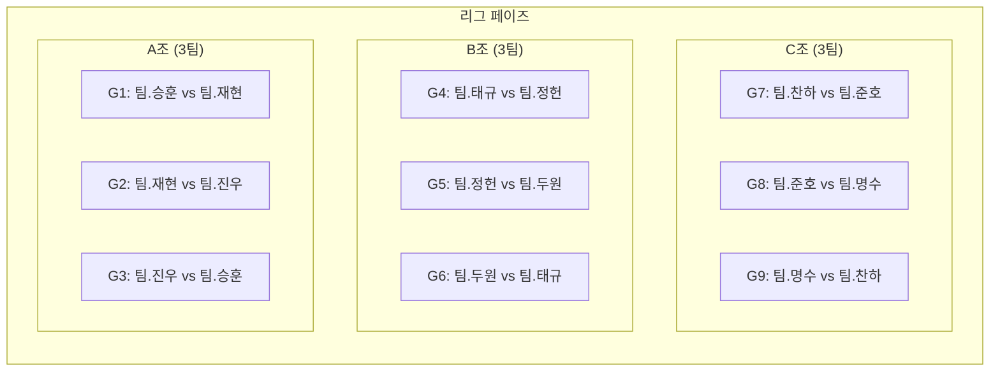
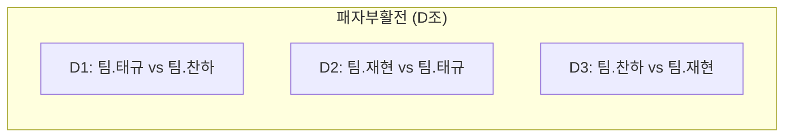
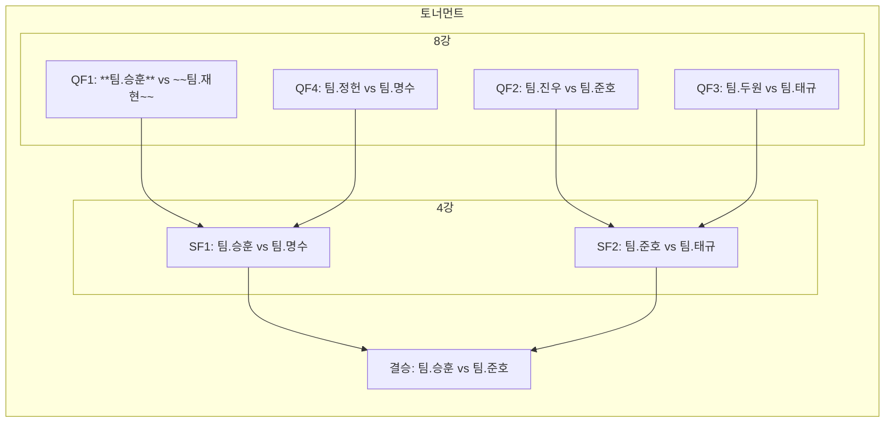

- 팀.찬하
	- 성록
	- 수민
- 팀.명수
	- 찬솔
	- 주하
- 팀.승훈
	- 진성
	- 재준
- 팀.준호
	- 동혁
	- 건호
- 팀.진우
	- 지환
	- 재우
- 팀.정헌
	- 승찬
	- 준혁
- 팀.재현
	- 예성
	- 현우
- 팀.두원
	- 지인
	- 창민
- 팀.태규
	- 전윤
	- 승한
---
**경기 규칙**  
- **승점**: 승리 3점 / 무승부 1점 / 패배 0점  
- **동률 시**:  
  1. 승자승  
  2. 세트 승리 수  
  3. 가위바위보
--- 

---
## A조 순위표
| 순위  | 팀명   | 경기(G) | 승(W) | 무(D) | 패(L) | 득실차(GD) | 승점(Pts) |
| --- | ---- | ----- | ---- | ---- | ---- | ------- | ------- |
| A1   | 팀.승훈 |    2   |   2   |   0   |   0   |     +3    |    6     |
| A3   | 팀.재현 |    2  |    0  |   0   |   2   |     -2 |     0   |
| A2   | 팀.진우 |    2   |    1 |   0   |   1   |     -1    |     3    |
순위 결정 A1:승훈, A2:진우, A3:재현
## B조 순위표
| 순위  | 팀명   | 경기(G) | 승(W) | 무(D) | 패(L) | 득실차(GD) | 승점(Pts) |
| --- | ---- | ----- | ---- | ---- | ---- | ------- | ------- |
| -   | 팀.태규 |  2    |   1   |   0   |   1   |    0    |    3    |
| -   | 팀.정헌 |   2   |   1   |   0   |   1   |    0     |    3     |
| -   | 팀.두원 |    2   |   1   |   0   |   1   |    0   |     3    |
가위바위보로 순위 결정 B1:두원, B2:정헌, B3:태규
## C조 순위표
| 순위  | 팀명   | 경기(G) | 승(W) | 무(D) | 패(L) | 득실차(GD) | 승점(Pts) |
| --- | ---- | ----- | ---- | ---- | ---- | ------- | ------- |
|  C3 | 팀.찬하 |   2    |   0   |   0   |   2   |     -4    |    0     |
| C2   | 팀.준호 |   2   |   1   |   0   |   1   |  0  |    3     |
| C1   | 팀.명수 |   2   |   2   |   0   |   0   |    +4     |    6     |
순위 결정 C1:명수, C2:준호, C3:찬하
---

---
## D조 순위표
| 순위  | 팀명   | 경기(G) | 승(W) | 무(D) | 패(L) | 득실차(GD) | 승점(Pts) |
| --- | ---- | ----- | ---- | ---- | ---- | ------- | ------- |
| D1   | 팀.재현 |    2   |   1   |    0  |    1  |    -1     |     3    |
| D2   | 팀.태규 |    2   |    2  |    0  |  0    |       +4  |      6   |
| D3   | 팀.찬하 |    2   |  0    |  0    |    2  |      -3   |     0    |
순위 결정 D1:태규, D2:재현, D3:찬하
---

우승: 팀.준호(준호, 동혁, 건호)
