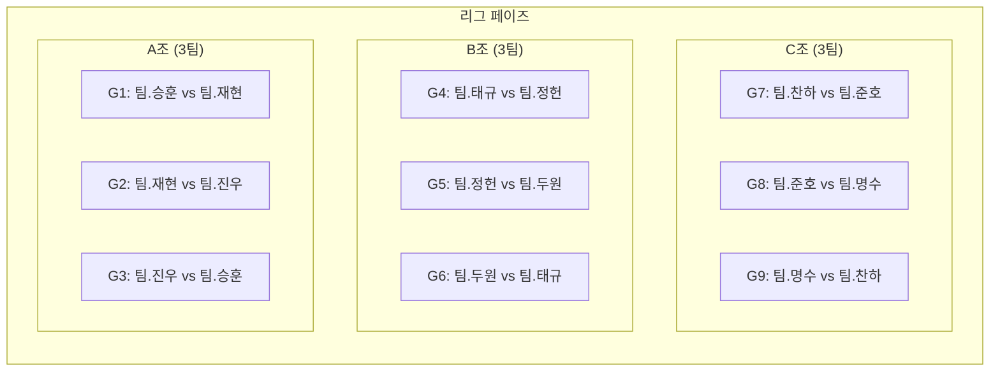
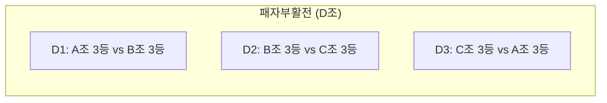
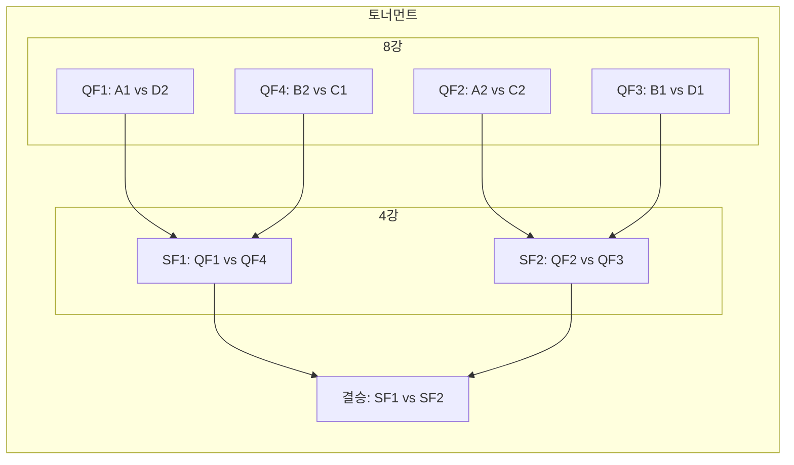

- 이찬하
	- 김성록
	- 김수민
- 김명수
	- 박찬솔
	- 이주하
- 오승훈
	- 박진성
	- 이재준
- 이준호
	- 서동혁
	- 나건호
- 정진우
	- 김지환
	- 김재우
- 김정헌
	- 이승찬
	- 박준혁
- 박재현
	- 손예성
	- 김현우
- 이두원
	- 김지인
	- 신창민
- 홍태규
	- 강전윤
	- 서승한
---
**경기 규칙**  
- **승점**: 승리 3점 / 무승부 1점 / 패배 0점  
- **동률 시**:  
  1. 승자승  
  2. 세트 승리 수  
  3. 가위바위보
--- 

---

---

